# Run tests on mobile

This is a step-by-step guide on how to run tests on mobile devices such as 
Android and iOS using a PC as companion device.

**Step 1**: Open landing page on mobile device:  
URL `http://<host>:<port>/_wave/index.html`,  
e.g. `http://192.168.1.170:8000/_wave/index.html`

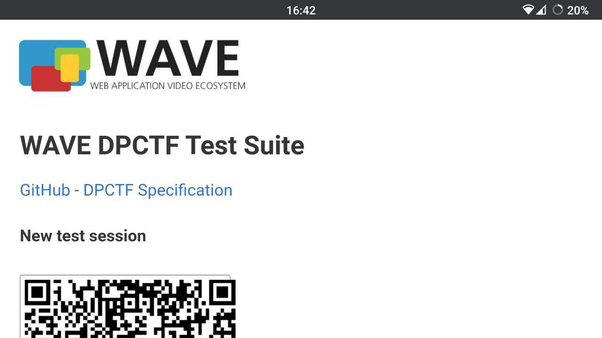

**Step 2**: Scroll down to see the session token

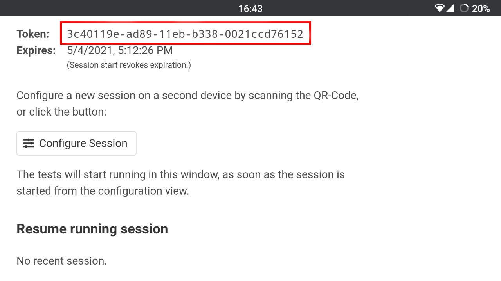

**Step 3**: On companion device,  
visit `http://<host>:<port>/_wave/configuration.html`  
e.g. `http://192.168.170:8000/_wave/configuration.html`

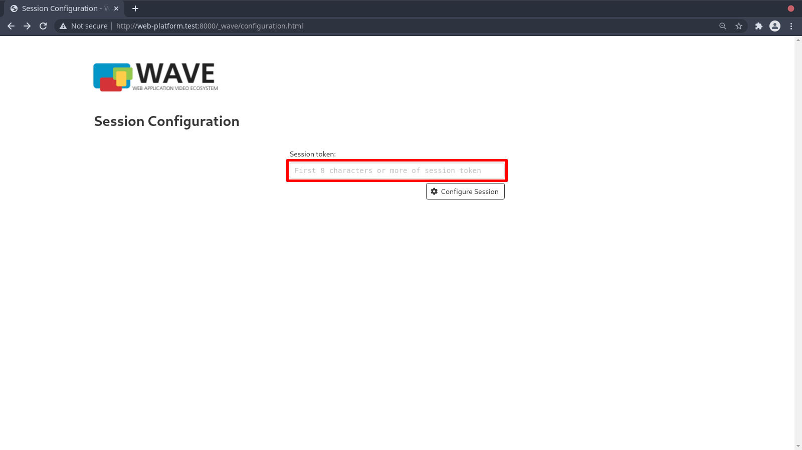

**Step 4**: Enter first 8 characters of token from mobile

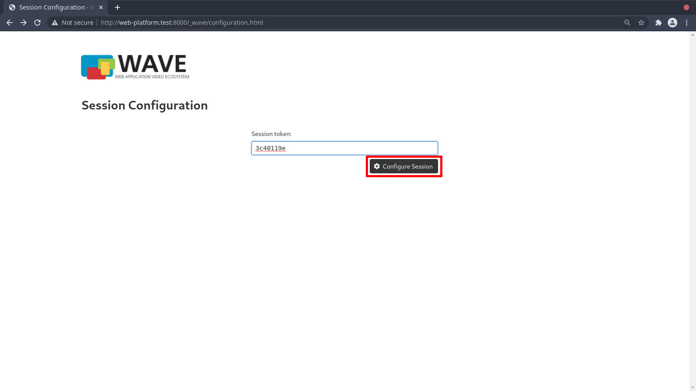

**Step 5**: Press "Configure Session"

**Step 6**: Press "None" to deselect all tests

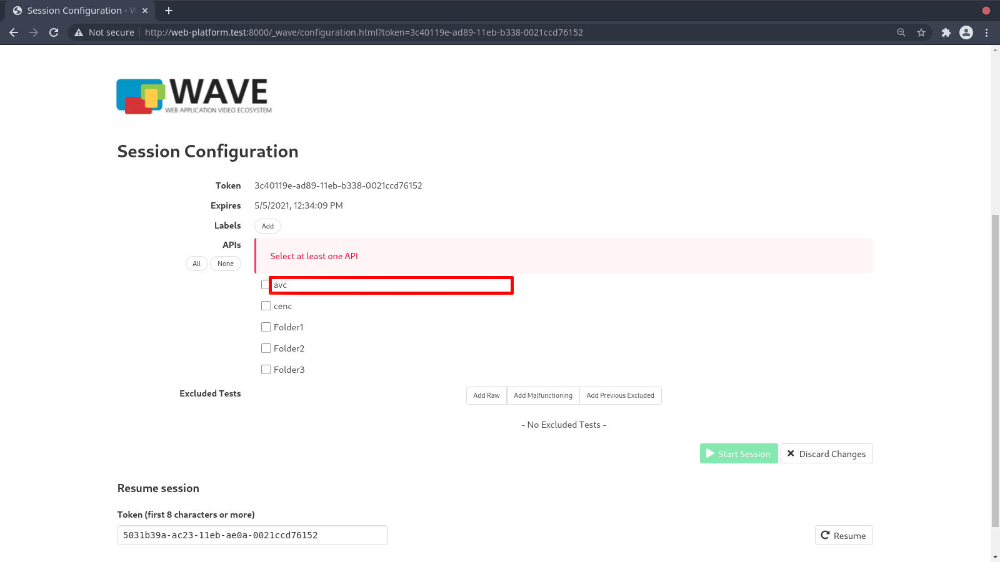

**Step 7**: Press on group name to open test list

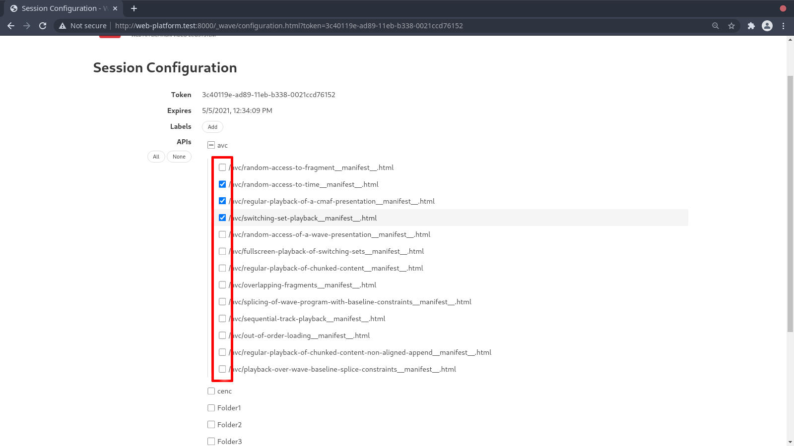

**Step 8**: Select the tests that shall be executed

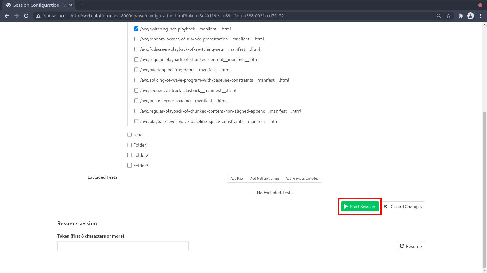

**Step 9**: At the bottom, press "Start session"

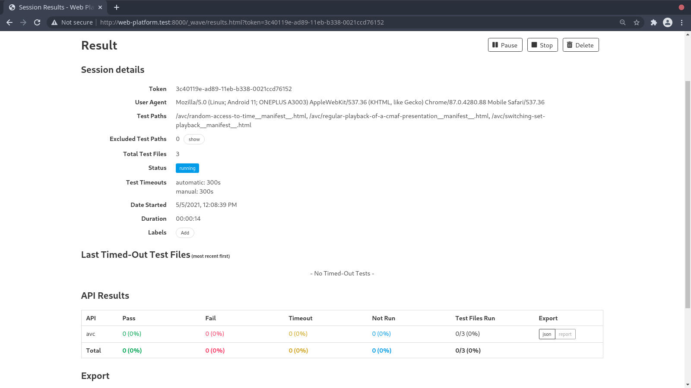

**Step 10**: The view changes to the results overview. Results are updated automatically.

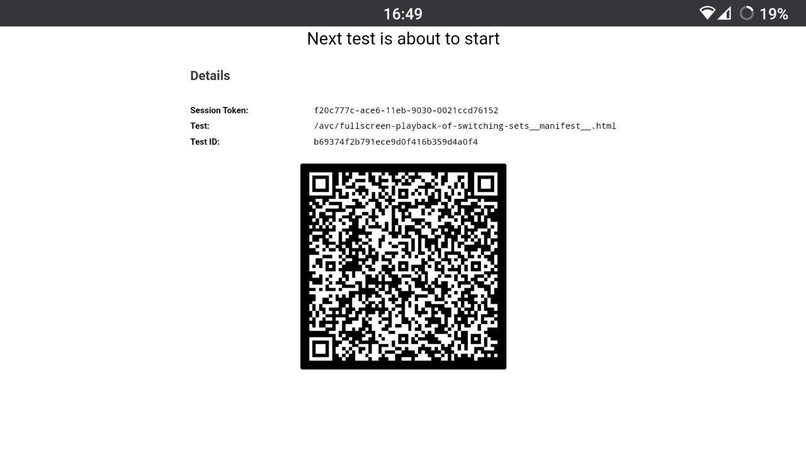

**Step 11**: On mobile, a pre test page is shown for about 5 seconds

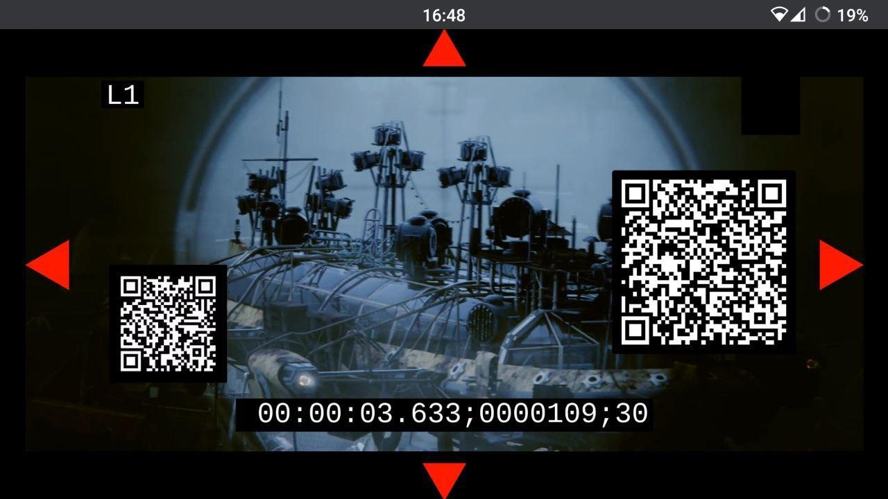

**Step 12**: Tests are being executed

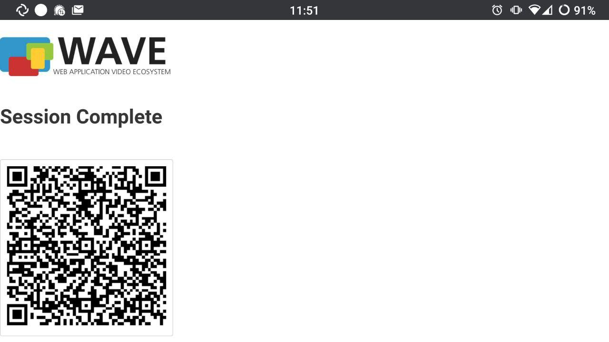

**Step 13**: After all tests have been run, a screen shows "Session Complete"

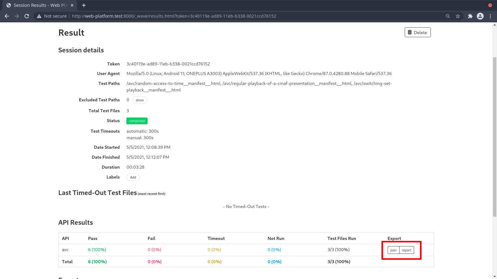

**Step 14**: On the companion screen, test results are received. Press "json" or "report" to get the results
