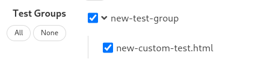

# DPCTF test runner docker image

This repository contains configuration files to build a docker image and run
it in a container with proper configuration.

## Requirements

- ⚠️ **It is highly recommended to use Linux for production. Windows and MacOS should be used for experimental purposes only!**
- Docker (tested with v20.10.6)
- docker-compose (tested with v1.29.1)
- Python 3 (for downloading the content)
- **Windows** and **Linux** require root/admin permissions for the provided commands. Please follow these instructions to run docker without root/admin:
  - [Run docker without root on Linux](https://docs.docker.com/engine/install/linux-postinstall/#manage-docker-as-a-non-root-user)
  - [Run docker without admin on Windows](https://docs.docker.com/docker-for-windows/install/#install-docker-desktop-on-windows)
- For deployment on Windows using WSL2 see [this](./WINDOWS_WSL.md)

## Create Image

To build the image, run the build script:

Linux/Mac:

```shell
./build.sh <commit-id/branch/tag> <image-version> [<options>]
```

Windows (no WSL):

```shell
.\build.bat <commit-id/branch/tag> <image-version> [<options>]
```

In this command **commit-id/branch/tag** specifies what code base to use
from the [DPCTF Test Runner repository](https://github.com/cta-wave/dpctf-test-runner) in the created
image. As indicated, this can be a commit id, a branch name or a tag.

**image-version** specifies the version string the created docker image is
tagged with. This allows to have multiple image with different versions.
The build script will name the image `dpctf:<image-version>`.

**options** - A list of optional arguments:

- **--reload-runner**: Reload the test runner, disabling cache
- **--reload-tests**: Reload test files, disabling cache
- **--tests-branch**: Which branch from dpctf-tests to use

For example (on Windows (no WSL) use build.bat):

```shell
./build.sh master latest
```

To rebuild the image using the cache but retrigger the download of the tests,
use the reload-tests argument:

```shell
./build.sh master latest --reload-tests
```

To rebuild the image using the cache but retrigger the download of the test
runner, use the reload-runner argument:

```shell
./build.sh master latest --reload-runner
```

Use dpcat branch from dpctf-tests repository when building:

```shell
./build.sh master latest --tests-branch dpcat
```

This will create a docker image for the latest code base on the master branch
and sets the version tag to "latest". The resulting image will have the name
`dpctf:latest`.  
Please make sure to re-create the container (run `docker-compose up -d`) each time you create a new image.

## Running the created image in a container

To run the created image in a properly configured container, set the desired image version:

`docker-compose.yml`

```yaml
services:
  dpctf:
    container_name: dpctf
    image: dpctf:latest
```

**container_name** defines the name of the container, so we can later
reference it when using docker commands specific to containers like start,
stop, view logs and so on. **image** specifies what image to use to create the
container. In this example, we use the version string of the example from the
section "Create Image". The file contains further configurations, but for now
this should suffice.

### Agree to EULA

In order to run the container you need to agree to the [EULA](https://github.com/cta-wave/dpctf-deploy/blob/master/End-User-License-Agreement.md). To do so, set the environment variable `AGREE_EULA` to `"yes"`.

`docker-compose.yml`

```yaml
services:
  dpctf:
    environment:
      AGREE_EULA: "yes"
```

### Import content

Next, import the content:

```
./import.sh
```

Windows (no WSL):

```
.\import.bat
```

This will download the content into the `content` directory, which is
accessible from the webserver by the same, relative path. For example,
`content/avc_sets/15_30_60/t1/stream.mpd` is accessible under
`http://<host>:<port>/content/avc_sets/15_30_60/t1/stream.mpd`.
When rerunning the script, no existing files will be overwritten. To reload
content, delete the corresponding files before running the `import.sh` script.

Every directory mapped into the container has to have its owner set to user id
1000 in order for the test runner to perform read and write actions. (e.g. `results` directory)

### Edit hosts file

It is required to map a set of domains to local host using the hosts file.

Linux and Mac (/etc/hosts): [hosts-linux](./hosts-linux.txt)

Windows (C:\Windows\System32\drivers\etc\hosts): [hosts-windows](./hosts-windows.txt)

### Start the container

To then start the container run the following command:

```shell
docker-compose up
```

This will use the configuration in the `docker-compose.yml` to create a new
container and run it.

Once the docker container is repeatedly running correctly, it may be run as a daemon using the `-d` flag:

```shell
docker-compose up -d
```

For more details on controlling the container when running it in the background, see the corresponding [section](#controlling-the-running-container).

The test runner can be configured using the `config.json`. For more details
see the [docs](https://github.com/cta-wave/dpctf-test-runner/blob/master/tools/wave/docs/config.md).

All test results will be stored in the `results` directory.

## Adding custom tests

To make custom tests avilable in the test runner put them into a subdirectory inside the tests directory. The subdirectory defines in what group the tests will be available in the test runner.

For example, the test file `new-custom-test.html` will be grouped under `new-test-group` by placing it under the following path:

```
tests/new-test-group/new-custom-test.html
```



## Mapping new content into the container

It may be useful to be able to use custom content with the test runner. This requires modification of the `docker-compose.yml` for any directory or file that should be mapped into the container.

Inside the `docker-compose.yml` under `volumes`, add a new line per file or directory to map:

```yaml
volumes:
  - <src_host_path>:<dest_container_path>
```

The `src_host_path` can be an absolute or relative path. The `dest_container_path` should be `/home/ubuntu/DPCTF/<dest_name>`, to make it available for serving from the test runners web server.

For example, to map a directory with additional content and a custom `test-config.json`:

```
ls

docker-compose.yml
new-content
test-config.json
```

```yaml
volumes:
  - ./new-content:/home/ubuntu/DPCTF/new-content
  - ./test-config.json:/home/ubuntu/DPCTF/test-config.json
```

Then restart the container using docker-compose command:

```
docker-compose up -d
```

Files are now accessible under the relative path to the test runner directory:

Content inside 'new-content':

```
http://web-platform.test:8000/new-content/
```

`test-config.json`:

```
http://web-platform.test:8000/test-config.json
```

## Controlling the running container

You can control the running container using a set of commands, which receive
the name of the container you want to perform the action on.

Start container

```shell
docker start <container_name>
```

Stop container

```shell
docker stop <container_name>
```

View logs

```shell
docker logs <container_name>
```

In our case, **container_name** is `dpctf`, unless it was changed in the `docker-compose.yml`.

## Running tests

In general, to access the test runners landing page, it can be accessed under the following URL:

```
http://<host-domain/ip>:<port>/_wave/index.html
```

- **host-domain/ip**: The domain or IP of the machine that hosts the DPCTF
  test runner. To access the host machine by its IP address, add the `host_override`
  parameter to the config.json. For more details see
  [the docs](https://github.com/cta-wave/dpctf-test-runner/blob/master/tools/wave/docs/config.md#210-host-override).
  Please note that for https tests (all encrypted tests requires https) a domain is required and IPs won't work. For this, you can use the built in DNS server, by using the commented port 53 mapping in the docker-compose.yml or you can configure your own for the domain `web-platform.test`.
- **port**: The port number the DPCTF test runner is runner on (default port is `8000`)

For further information on how to configure sessions and general usage see [the documentation](https://github.com/cta-wave/dpctf-test-runner/blob/master/tools/wave/docs/usage/usage.md) (please make sure that dpctf is selected when configuring a new session).

Additionally, it is possible to run tests using the [REST API](https://github.com/cta-wave/dpctf-test-runner/blob/master/tools/wave/docs/rest-api/README.md).

### DNS server

To fully run the WAVE DPCTF test suite requires one of the following:

- Editing the DNS server used by the device being tested to include web-platform.test
- Setting up another DNS server which includes web-platform.test and pointing the device at this DNS server
  - This could be the DNS server included in the docker image
  - Enabling a DNS server that includes web-platform.test may be complex as OS like Ubuntu have a DNS proxy running on port 53 already.
- Most devices have (buried) UI to over-ride the default DNS server. Alternatively it may be necessary to put the device being tested on a separate network, provide a dedicated DHCP server and include the address of a DNS server supporting web-platform.test in the response of that dedicated DHCP server.

### Run on host machine


The most simple use case is to execute the test on the same machine as the
DPCTF test runner is running on.

1. Run the docker container on the host machine
2. Open the landing page `http://localhost:<port>/_wave/index.html` in Browser (As everything runs on the same machine, the host can be `localhost` used)
3. Use the "Configure Session" button on the landing page to configure and start the session

### Run on separate DUT (TV, Mobile, etc.)


Another common use case is to have a separate device under test, like a TV or
mobile device, to run the tests on.

1. Set the [`host_override`](https://github.com/cta-wave/dpctf-test-runner/blob/master/tools/wave/docs/config.md#210-host-override) parameter to the IP of the host machine.
2. Run the docker container on the host machine
3. Open the landing page `http://<host_ip>:<port>/_wave/index.html` on the DUT (TV, mobile, ...)
4. On the host machine open the URL `http://<host_ip>:<port>/_wave/configuration.html` and enter the session token displayed on the
   landing page (on TV or mobile) to configure and start the session.

### Run on separate DUT using companion device


A companion device may be used to configure and manage a test session. In this
setup, the test runner is hosted on one device, whereas another device is used
to configure and monitor the test session that runs on the DUT.

1. Set the [`host_override`](https://github.com/cta-wave/dpctf-test-runner/blob/master/tools/wave/docs/config.md#210-host-override) parameter to the IP of the host machine.
2. Run the docker container on the host machine
3. Open the landing page `http://<host_ip>:<port>/_wave/index.html` on the DUT (TV, mobile, ...)
4. Access configuration page to configure and start session using one of these options:
   - Open the URL `http://<host_ip>:<port>/_wave/configuration.html` and enter the session token displayed on the landing page
   - Scan the QR code displayed on the landing page

## Debugging tests

When debugging a failing test, there are multiple ways to get to the error messages:

1. On the browser console
2. The test result beneath the video after test is finished (displayed for around 5 seconds)
3. After test is finished, on the results page, in the results table in the export column click on "json". In the json file, look for the desired test
   object containing the error.
4. After test group is finished, on the results page, in the results table in the export column click on "report". A test report opens in a new tab
   (although this may be blocked by the browser). Click on show messages in the table header.

## Detailed Guides

- [Run tests on mobile](./MOBILE_USAGE.md)

## Known Bugs

### SSL certificate invalid

As the default SSL certificate is not descended from a normal root certificate supported by web browsers, it may be required to add an exception to the DUTs web browser in order for HTTPS tests to work.

# Device Observation Framework Container

The [Device Observation Framework](https://github.com/cta-wave/device-observation-framework) may be run in a docker container for easy setup and use. There are a few steps to build the image and run the container:

## Build the image

To build the image run

```console
$ ./build-dof.sh
```

To rebuild with latest version of OF run

```console
$ ./build-dof.sh --reload-dof
```

## Running observations

To run observations, use the `analyse-recording.sh` script:

```console
$ ./analyse-recording.sh <mp4-filepath> <OF-arguments>
```

For example:

```console
$ ./analyse-recording.sh ./recording.mp4 --log debug --scan general
```

For all available OF options, please refer to the [documentation](https://github.com/cta-wave/device-observation-framework#using-the-device-observation-framework)

Any log files created are stored in the `logs` directory
