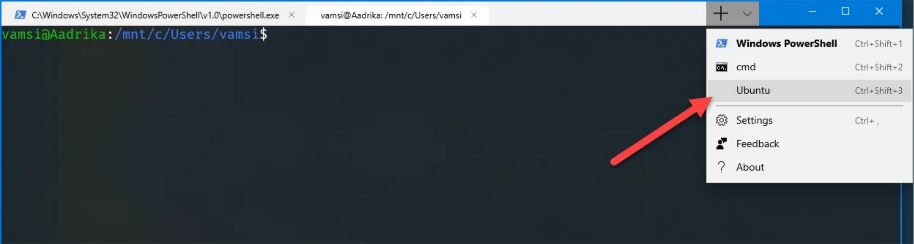

# Setup on Windows using WSL2

## Requirements

- Windows 10 version 2004 and higher (Build 19041 and higher) or Windows 11

## 1. Establish a compatible Windows/Linux/Docker environment

### 1.1 Download/install WSL2

1. Start PowerShell as administrator
2. Enable WSL by running the following command:  
`dism.exe /online /enable-feature /featurename:Microsoft-Windows-Subsystem-Linux /all /norestart`
3. Set WSL2 as default by running the command:  
`wsl –set-default-version 2`

### 1.2 Verify LXSSMANAGER is running

This Service makes available a subsystem that deals with Linux executables (LX’s) called ELFs.

1. Press WIN+R
2. Type: services.msc
3. Find LXSSMANAGER
4. If it is not running: Right click it and select RESTART
5. (optional) Set auto-startup by right clicking it, select PROPERTIES and set startup type to AUTO

### 1.3 Download/install a Linux distro

This guide will assume Ubuntu 20.04.

1. Follow instructions, such as [these](https://windowsloop.com/install-linux-subsystem-windows-10/)
2. Verify you have access to the installed Linux distro by opening Windows Terminal and making sure the pull-down is available.  

### 1.4 Download/install Docker Desktop

1. Download and install Docker Desktop (not in Microsoft App Store)
2. Make certain WSL2 is checked under Settings->General
3. If it is not enabled, go to Resources->Advanced->WSL Integration
4. Check the WSL2 box and restart docker

## 2. Verify user ID

1. Open Windows Terminal
2. Click on the pull down tab and select Ubuntu (or your distro)
3. Check UID by typing `echo $UID`. This must return UID 1000 before continuing with this installation
4. If it is not 1000, unfortunately threre is no easy or quick fix. All items owned by the prior UID should be changed over as well. See [this](https://askubuntu.com/questions/16700/how-can-i-change-my-own-user-id)

## 3. Build the DPC test runner docker image

1. Download the [dpctf-deploy files](https://github.com/cta-wave/dpctf-deploy/archive/refs/heads/master.zip) from github and extract them.
2. In Windows Terminal Ubuntu change directory to the extracted files directory
3. Follow the instructions in the [README](https://github.com/cta-wave/dpctf-deploy#readme). (As WSL is a linux environment, you have to use the linux commands)
